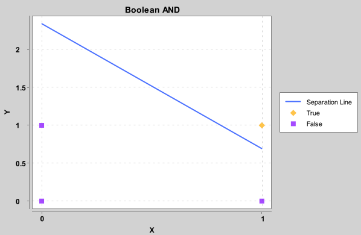

# Perceptron App

As the eldritch forces of this perceptron app learn to classify the AND boolean logic, they call forth ancient and 
forbidden knowledge. With each iteration, the app becomes more attuned to the cosmic horrors that lie beyond our 
understanding. But beware, for too much learning can drive even the bravest soul to insanity.

## Technologies Used

- Java 17
- Kotlin
- Gradle Kotlin
- SpringBoot
- Spring Shell
- XChart

## Installation

To unleash the powers of the elder gods upon this app, you must first install Kotlin and Gradle on your system. Then, 
clone this repository, run `./gradlew bootJar` to build the app and `./java -jar build/libs/perceptron_kotlin.jar` to 
summon forth the ancient knowledge in interactive mode.

Alternatively you can run the app directly from an IDE, such as IntelliJ IDEA.

Or you can directly download the jar file from the releases page. In this case you will need to have only Java 17 
installed

## Usage
As this is a Spring Shell app, you can use the `help` command to see a list of available commands. 

### Training
The `train` command will train the perceptron on the AND boolean logic. You can specify the number of iterations
with the `--epochs` option. The default is 10. This will also print the weights of the perceptron while training.
The `--show-chart` is enabled by default, but you can disable it with the `--show-chart false` option.
The chart will show live learning of the perceptron.
Note: The chart window may be out of focus when you run the app in an IDE, depending on your system. You can click on 
the chart window to bring it into focus.

This is and example of the chart after 10 epochs of training:

The chart represents the AND logic gate.
You can see that the perceptron has learned to classify the AND boolean logic. Everything above the separation line is
classified as 1, and everything below is classified as 0.

In particular:
- a point on X axis 1 and Y axis 1 is classified as 1 (true and true is true)
- a point on X axis 0 and Y axis 1 is classified as 0 (false and true is false)
- a point on X axis 1 and Y axis 0 is classified as 0 (true and false is false)
- a point on X axis 0 and Y axis 0 is classified as 0 (false and false is false)

### Evaluation
The `predict` command will predict the output of the perceptron for AND logic gate. If the perceptron has not been 
trained yet, it will probably classify all the inputs incorrectly.

You can try the `predict` command before training the perceptron. The perceptron will probably classify all the inputs
incorrectly. Then you can train the perceptron and try the `predict` command again. The perceptron should now classify
the inputs correctly.

### Exit
The `exit` command will exit the app.

## Limitations
This app is only a toy implementation of perceptron, it currently only supports the AND boolean logic and cannot 
classify other logic gates.

